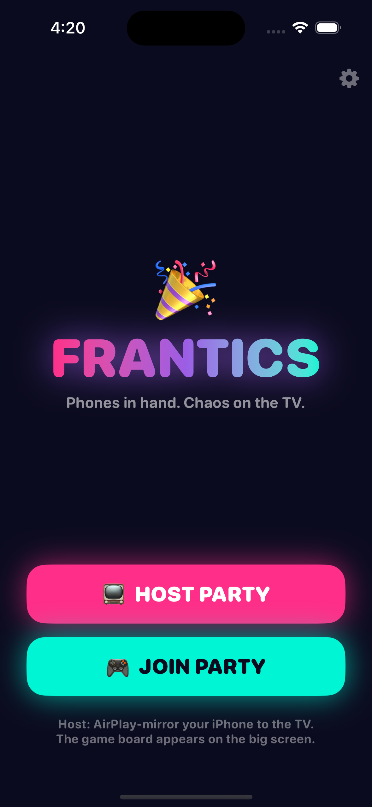
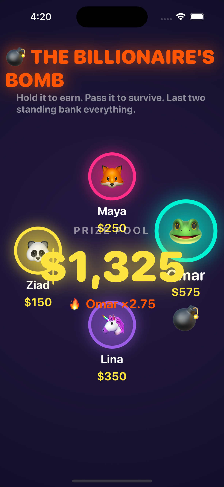
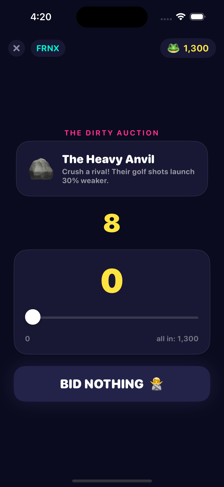
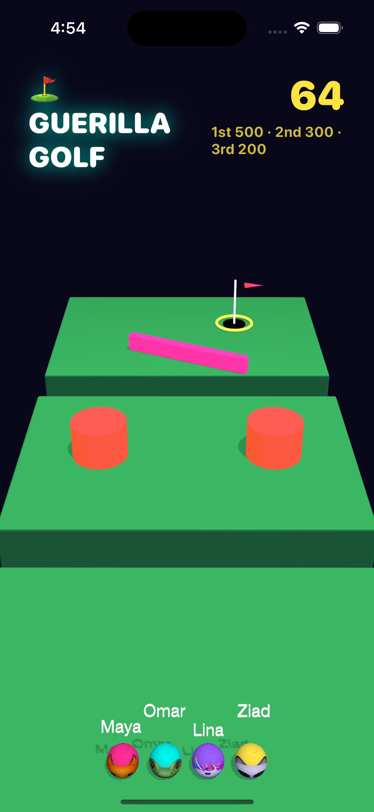

# 🎉 Frantics

A *Frantics*-style couch party game. **One iPhone is the TV.** The host AirPlay-mirrors their iPhone to the big screen — the app claims the external display and renders the shared **game board** there, while every phone (including the host's) stays a private **controller**. A Node.js server is the single source of truth.

| Main menu | TV board — The Bomb | Controller — The Auction | TV board — Golf |
|---|---|---|---|
|  |  |  |  |

*(Board screenshots above were captured on a portrait iPhone simulator — on a real TV the board renders full-screen 16:9.)*

## How the TV trick works

iOS supports *external display scenes*: when the host starts **Screen Mirroring** (AirPlay) or plugs in an HDMI adapter, the system hands the app the TV as a separate, non-interactive screen. Frantics opts in (`UIApplicationSupportsMultipleScenes` + the `windowExternalDisplayNonInteractive` scene role in [AppDelegate.swift](ios/Frantics/App/AppDelegate.swift)), so the TV shows [BoardRootView](ios/Frantics/Board/BoardRootView.swift) while the host's phone keeps showing their private controller. No Apple TV app, no web TV client.

```
   TV (AirPlay / HDMI)  ←  host iPhone renders the board on the external screen
                              ▲
                              │ room_state snapshots + aim/fire relays (WebSocket)
                              ▼
                  ┌─────────────────────────┐
                  │  Node.js game server     │   ← authoritative scores, bids,
                  │  server/ (TypeScript)    │     bomb fuse, phase machine
                  └─────────────────────────┘
                              ▲
                              │ bids, targets, slingshot vectors, PASS (WebSocket)
                              ▼
        📱 all players' iPhones — same app, "JOIN PARTY" + room code
```

## The game loop

`Lobby → Dirty Auction → Guerilla Golf → Dirty Auction → Billionaire's Bomb → Podium → (replay → Auction…)`

1. **Lobby** — host creates a party, TV shows a 4-letter room code, avatars drop in as friends join (2–8 players, everyone starts with **1000 points**).
2. **The Dirty Auction** — 15 s of sealed bids on a sabotage item. Winner pays their bid and picks a victim on their phone:
   - 🪨 **The Heavy Anvil** (before golf): victim's shots launch **30 % weaker**.
   - 🧈 **Butter Fingers** (before the bomb): victim's PASS button **jams for 2 s** every time they catch the bomb.
3. **⛳️ Guerilla Golf** — simultaneous slingshot race across a **3D low-poly island course** (SceneKit physics on the host's board, PS4-Frantics style: floating fairways over the void, bumpers, a spinning paddle, a flag on the green). Drag back on your phone's touchpad, 3D aim arrows stream live to the TV (~30 msg/s), release to fire — and to bodycheck rivals off the map. Bounties: **500 / 300 / 200**, then 100 per finisher.
4. **💣 The Billionaire's Bomb** — hot-potato chicken. Holding the bomb mints cash with a rising greed multiplier; tilt your phone (or tap an arrow) + **PASS** to shove it at a neighbor. The fuse is hidden — explode and your unbanked cash burns. Rounds repeat until **exactly two survive**, who bank everything **+ $250**.
5. **🏆 Podium** — confetti, crowns, and a **Replay?** button. If *everyone* votes replay, scores reset and the loop jumps straight back to the auction.

## Quick start (same WiFi)

**1. Run the server** (Node 20+):

```bash
cd server
npm install
npm run dev
#   🎉 Frantics server is up
#      LAN:  ws://192.168.1.70:8080   ← put this in the iPhone app
```

**2. Run the app:** open `ios/Frantics.xcodeproj` in Xcode 16+, select your iPhone (or a simulator), Run. On first launch tap ⚙️ and enter the server's LAN address. Sign with your own team in *Signing & Capabilities* for a real device.

**3. Party:** host taps **HOST PARTY**, starts **Screen Mirroring** to the TV (Control Center → Screen Mirroring), friends tap **JOIN PARTY** with the room code. The host phone's `tv` icon lights up when the external display is attached; there's also an on-phone board preview behind that icon for development.

## Deploy the server (play over the internet)

The server is a single stateless-ish process (rooms live in memory) — any Node host or the included [Dockerfile](server/Dockerfile) works:

- **Render / Railway:** new web service from this repo, root `server/`, build `npm install && npm run build`, start `npm start`. Use the resulting `wss://your-app.onrender.com` URL in the app's settings.
- **Fly.io / any Docker host:** `docker build -t frantics server/ && docker run -p 8080:8080 frantics`.
- `GET /health` returns `{ ok, rooms }` for monitoring.

## Repo layout

```
server/             Node.js + TypeScript authoritative game server
  src/protocol.ts     wire contract + game constants (timers, bounties…)
  src/room.ts         the whole state machine (lobby/auction/golf/bomb/podium)
  src/server.ts       WebSocket plumbing + room manager
  scripts/smoke.ts    full-game E2E test with 4 fake clients
ios/                SwiftUI iPhone app (controller + TV board in one binary)
  Frantics/App/       app + phone/external-display scene delegates
  Frantics/Core/      GameClient (WebSocket), models, tilt, haptics
  Frantics/Phone/     controller screens for every phase
  Frantics/Board/     TV screens, incl. the SpriteKit golf scene
```

## Protocol cheat-sheet

Every frame is JSON with a `t` discriminator ([protocol.ts](server/src/protocol.ts) ⇄ [Models.swift](ios/Frantics/Core/Models.swift)).

| Direction | Message | Meaning |
|---|---|---|
| 📱→ | `create_room` / `join_room` / `rejoin` | seat management (rejoin reclaims a seat after a drop) |
| 📱→ | `submit_bid { amount }` | sealed auction bid |
| 📱→ | `choose_target { targetId }` | auction winner picks a victim |
| 📱→ | `aim { angle, power }` · `fire` · `aim_clear` | slingshot input, throttled to ~30/s |
| 📱→ | `pass_bomb { direction }` | tilt-and-tap hand-off |
| 📱→ | `replay` | podium vote |
| 🖥→ | `golf_finished { order }` | host board reports physics results |
| →📱🖥 | `room_state { state }` | full authoritative snapshot on every change |
| →🖥 | `aim` / `aim_clear` / `fire` | relays for the board's physics scene |

## Development

```bash
cd server
npm run typecheck   # strict TS
npm run smoke       # full game E2E in ~10 s (FAST_GAME shrinks every timer)
```

- `ALLOW_SOLO=1` lets a lone host start a game while developing.
- The app has screenshot/dev fixtures: launch with env `FRANTICS_DEMO=board-bomb` (or `board-lobby`, `board-golf`, `board-podium`, `phone-auction`, `phone-bomb`, …) to render any screen with canned data, no server needed.
- Game feel lives in two files: timers/payouts in [protocol.ts](server/src/protocol.ts) (`CONST`), 3D golf physics/course layout in [Golf3DBoard.swift](ios/Frantics/Board/Golf3DBoard.swift).
